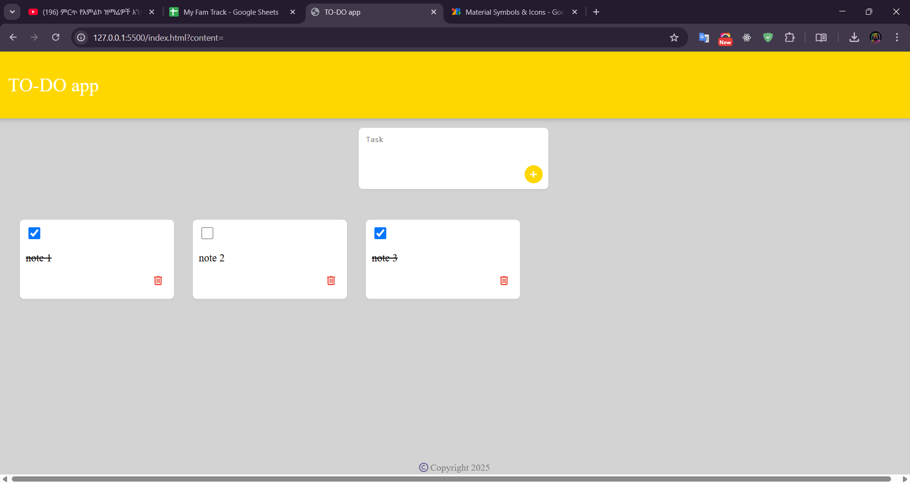

# 📝 To-Do App

A simple **To-Do List App** that allows users to add, check, and delete tasks. Tasks are stored in **local storage**, so they persist even after refreshing the page.

## 🚀 Features
✅ Add tasks dynamically  
✅ Mark tasks as completed with a checkbox  
✅ Delete tasks using an SVG trash icon  
✅ Persistent storage with **localStorage**  
✅ Responsive and minimal design  

## 📸 Screenshot
 
## 🛠️ Technologies Used
- **HTML**  
- **CSS**  
- **JavaScript (DOM Manipulation, LocalStorage)**  

## 💡 How to Use
1️⃣ Type your task in the input field.  
2️⃣ Click the **➕ button** to add it to the list.  
3️⃣ Check the box ☑️ to mark it as completed.  
4️⃣ Click the 🗑️ (trash icon) to delete a task.  

## 📂 Project Structure
```
/assets/         # Contains the SVG delete icon and screenshots  
/style.css       # Stylesheet for the app  
/script.js       # JavaScript logic (handling tasks and local storage)  
/index.html      # Main HTML file  
```
